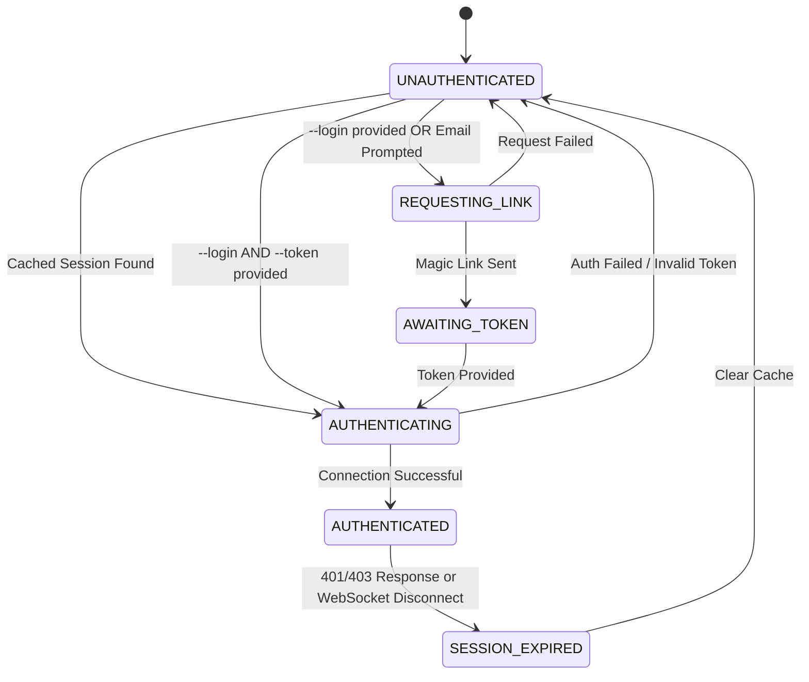

# Authentication Design: Yoker Chat Client

**Date**: 2026-05-20
**Status**: Final Design
**Related Task**: 1.2 Authentication Module
**Reference**: [analysis/yoker-chat-client.md](/Users/xtof/Workspace/agentic/yoker-chat/analysis/yoker-chat-client.md)

## 1. Authentication State Machine

The authentication flow is modeled as a state machine to handle the transitions between cached sessions, interactive prompts, and non-interactive credential provision.

### States

| State | Description |
|-------|-------------|
| `UNAUTHENTICATED` | Initial state. No valid credentials or session found. |
| `REQUESTING_LINK` | Process of requesting a magic link from the server for a specific email. |
| `AWAITING_TOKEN` | Server has sent a magic link; client is waiting for the user to provide the token. |
| `AUTHENTICATING` | Client is attempting to establish a connection using a token or cached session. |
| `AUTHENTICATED` | Successfully connected and authenticated with the Roomz server. |
| `SESSION_EXPIRED` | Previously authenticated, but the session is no longer valid. |

### State Transitions



---

## 2. Session Cache Structure

The session is persisted to `~/.cache/yoker-chat/session.json` to enable automatic reconnection.

### File Format (JSON)

```json
{
  "version": "1.0",
  "session": {
    "cookie": "session_id=abc123def456...",
    "server_url": "http://localhost:5000",
    "email": "bot@example.com",
    "created_at": "2026-05-20T10:00:00Z",
    "expires_at": "2026-06-20T10:00:00Z"
  },
  "metadata": {
    "last_used": "2026-05-20T12:30:00Z",
    "client_version": "0.1.0"
  }
}
```

### Security Requirements
- **Permissions**: The file MUST be created with `0600` (read/write for owner only).
- **Storage**: Only the session cookie and basic metadata are stored. Never store the magic link token itself in the cache, as tokens are typically short-lived and used only once for session creation.
- **Clearance**: The cache is deleted when:
  - An explicit logout is performed.
  - A `SESSION_EXPIRED` state is reached and cannot be recovered.

---

## 3. ChatClient and AsyncClient Integration

The `ChatClient` acts as the orchestrator, while the `Roomz.AsyncClient` handles the transport and protocol-level authentication.

### Interaction Flow

1. **Initialization**: `ChatClient` initializes the `AsyncClient` with the `server_url`.
2. **Session Retrieval**: `ChatClient` checks the `SessionCache`. If a valid cookie exists, it calls `AsyncClient.connect(cookie=...)`.
3. **Authentication Sequence**:
   - If no cache, `ChatClient` manages the loop:
     - `AsyncClient.login(email)` $\rightarrow$ triggers server to send magic link.
     - `ChatClient` captures user input for the token.
     - `AsyncClient.connect(token=...)` $\rightarrow$ establishes WebSocket and receives session cookie.
4. **Session Persistence**: Upon successful `connect()`, `AsyncClient` provides the session cookie. `ChatClient` immediately saves this to `SessionCache`.
5. **Identity Setup**: Once `AUTHENTICATED`, `ChatClient` calls `AsyncClient.set_name(display_name)` to finalize the bot's identity in the room.

---

## 4. Error Handling Strategies

### Token & Session Failures

| Scenario | Detected By | Action |
|-----------|-------------|--------|
| **Invalid Token** | `AsyncClient.connect()` throws `AuthError` | Log "Invalid token provided". If interactive, re-prompt. If non-interactive, exit with code 1. |
| **Expired Session** | `AsyncClient` emits `disconnect` event OR server returns 401 | Transition to `SESSION_EXPIRED`. Clear `SessionCache`. Trigger re-authentication flow. |
| **Magic Link Failure** | `AsyncClient.login()` returns error object | Log error (e.g., "Email not allowed"). Transition back to `UNAUTHENTICATED`. |
| **Server Unreachable** | Connection timeout / DNS failure | Implementation of exponential backoff for reconnection. Do NOT clear cache unless a 401/403 is explicitly received. |

### Recovery Logic

```python
async def handle_auth_failure(self, error):
    if isinstance(error, SessionExpiredError):
        log.warning("session_expired", action="clearing_cache")
        self.cache.clear()
        await self._authenticate() # Restart auth flow
    elif isinstance(error, InvalidTokenError):
        if self.is_interactive:
            log.error("invalid_token", action="reprompting")
            await self._prompt_for_token()
        else:
            log.critical("auth_failed", action="exiting")
            sys.exit(1)
```
