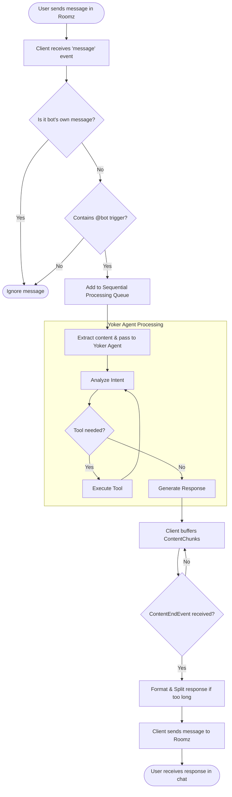

# Process Models: Yoker Chat Client

## Overview
The Yoker Chat Client acts as a bidirectional bridge between the Roomz WebSocket server and the Yoker Agent engine. It manages the lifecycle of messages, ensuring that AI processing is triggered only on specific events and that responses are formatted correctly for the chat platform.

## Participants
| Role | Responsibility |
|------|---------------|
| **Roomz Server** | Source of incoming messages; destination for bot responses. |
| **Chat Client** | Message routing, filtering, queuing, and session management. |
| **Yoker Agent** | AI processing, tool execution, and response generation. |

## Process Flow: Message Lifecycle
This flow describes how a single user message is handled from the moment it is sent in Roomz until the bot replies.

## Business Rules & Logic

### 1. Message Filtering Logic
- **Anti-Loop**: `if (message.sender == bot.email) then discard`. This prevents the bot from responding to its own output, which would cause an infinite loop.
- **Triggering**: `if (message.content contains any(triggers)) then process`. Only messages explicitly addressing the bot are handled.

### 2. Sequential Processing (The Queue)
To avoid race conditions and maintain a coherent conversation thread, the client employs a FIFO (First-In-First-Out) queue:
1. Incoming mentioned messages are added to the `_message_queue`.
2. A single worker task processes messages one by one.
3. The next message is only dequeued after the previous one has been fully sent back to Roomz.

### 3. Authentication & Session Recovery
The client prioritizes efficiency to minimize interactive prompts:
1. **Cache Check**: Check `session.json` for a valid cookie.
2. **Auto-Connect**: If valid, connect immediately.
3. **Fallback**: If invalid/missing, use `--login` and `--token` arguments.
4. **Interactive**: If no arguments, prompt the user for email $\rightarrow$ request magic link $\rightarrow$ prompt for token.

## Exceptions & Error Handling
| Exception | Handling Process | Business Impact |
|-----------|------------------|------------------|
| **Network Disconnect** | Exponential backoff reconnection | Temporary unavailability of the bot |
| **Agent Processing Error** | Send "I'm sorry, I encountered an error" to chat | User is notified that the request failed |
| **Malformed Message** | Log error and skip message | Single message is lost, but bot remains stable |
| **Rate Limit Hit** | Delay processing of queue | Increased latency for user responses |
