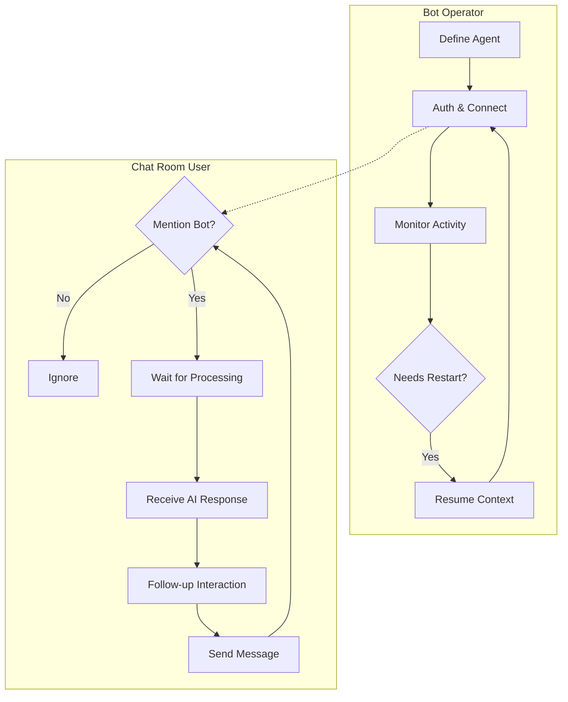

# User Journeys: Yoker Chat Client

## Persona: Bot Operator
The Bot Operator is a technical administrator responsible for deploying, configuring, and maintaining the AI bot within a Roomz chat room. Their goal is to ensure the bot is active, helpful, and correctly configured.

### Journey 1: Initial Bot Deployment
| Stage | User Action | System Response | Pain Points | Opportunities |
|-------|-------------|----------------|-------------|-----------------|
| **Preparation** | Creates bot email and adds to Roomz allowed list | Server accepts bot account | Manual account creation is tedious | API-based bot registration |
| **Configuration** | Writes agent definition (`.md`) and Yoker config (`.toml`) | Files saved to disk | Managing multiple config files | Centralized config management |
| **Authentication** | Runs `yoker-chat` and provides email/token | Client authenticates and connects to Roomz | Token expiration | Long-lived session tokens |
| **Verification** | Sends a test message in the chat room | Bot responds correctly based on definition | Latency in first response | Warm-up phase for agent |
| **Persistence** | Closes client; restarts client | Client reconnects using cached session | Losing session on crash | Robust cache recovery |

### Journey 2: Resuming a Conversation Context
| Stage | User Action | System Response | Pain Points | Opportunities |
|-------|-------------|----------------|-------------|-----------------|
| **Launch** | Runs `yoker-chat --resume` | Client lists available historical sessions | Finding the right session among many | Metadata-rich session lists |
| **Selection** | Selects a specific session (e.g., "1") | Agent loads previous conversation history | Slow loading for very long contexts | Context summarization |
| **Interaction** | Asks a question referencing previous chat | Bot provides a context-aware response | Context drift over time | Context window management |

## Persona: Chat Room User
The Chat Room User is an employee or collaborator using Roomz for communication. They use the bot to get quick answers or perform tasks without leaving the chat.

### Journey 1: Getting Help from the Bot
| Stage | User Action | System Response | Pain Points | Opportunities |
|-------|-------------|----------------|-------------|-----------------|
| **Trigger** | Types `@bot How do I set up my VPN?` | Client detects mention and queues message | Bot ignoring mentions if misspelled | Fuzzy matching for triggers |
| **Wait** | Waits for the bot to process | Bot is "Thinking" (internally) | Uncertainty if bot is working | "Bot is typing..." indicator |
| **Resolution** | Reads the bot's response | Bot sends a formatted answer with steps | Long responses being cut off | Response splitting/pagination |
| **Follow-up** | Asks a clarifying question `@bot What about Mac?` | Bot responds using context of the first question | Bot forgetting previous turns | Persistent session IDs |

## Journey Flow

## Success Metrics
- **Time to First Response**: Duration from user mention to bot reply.
- **Context Accuracy**: Percentage of follow-up questions answered correctly using previous context.
- **Uptime**: Percentage of time the bot is connected and responding.
- **User Adoption**: Number of unique users interacting with the bot per day.
